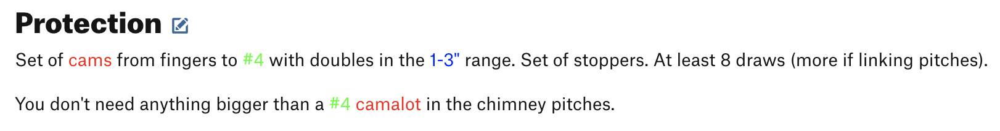

# Climbing Size Matters

Have you ever looked at a route on Mountain Project, and had to search
for what gear was recommended to protect the route? And then you don't
even have a red Alien, so you have to figure out what size your gear
is that could act as a substitute?

This is a browser extension that helps improve the UX on Mountain Project
to highlight gear and translate to your gear.

> [!WARNING]
> This is still very early stage and under active development. Features and documentation
> may change rapidly.

## Setup

This repository uses:
- pnpm: [Installation](https://pnpm.io/installation)
- wxt: [WXT](https://wxt.dev/)

We use WXT for hot-reloading while developing. So if you're actively developing,
just use `pnpm dev` and WXT will build and automatically open the browser with the
extension loaded.

1. Clone this repo
2. `pnpm install`
3. `pnpm dev`

## Installation

### From the Web Store

Currently this is only enabled for testing users, so we can't search for it.

We have to go directly using the URL built from our org (`climbing-size-matters`) and
the item ID. Currently this is https://chromewebstore.google.com/detail/climbing-size-matters/igeaonjjikppbfcchekinmlhfehfcepp

### From Source

1. Follow the Setup above, then run `pnpm build`
2. Open your Chromium browser
3. Enable Developer Mode
4. Click "Load unpacked"
5. Select the built folder (e.g. `dist/chrome-mv3`)

Parallel steps are available for Firefox thanks to WXT! Just use `pnpm build:firefox`
and the unpacked directory will be built to `dist/firefox-mv2`.

## Usage

Load a route page on Mountain Project (e.g.
[Epinepherine](https://www.mountainproject.com/route/105732422/epinephrine)).
This extension should change the page's content.

Right now, it just highlights the mentions of gear and crack size different colors:

## Contributing

Pull requests are welcome. For major changes, please open an issue first to discuss what you would like to change.

Please make sure to update tests as appropriate.

## License

[MIT](https://choosealicense.com/licenses/mit/)